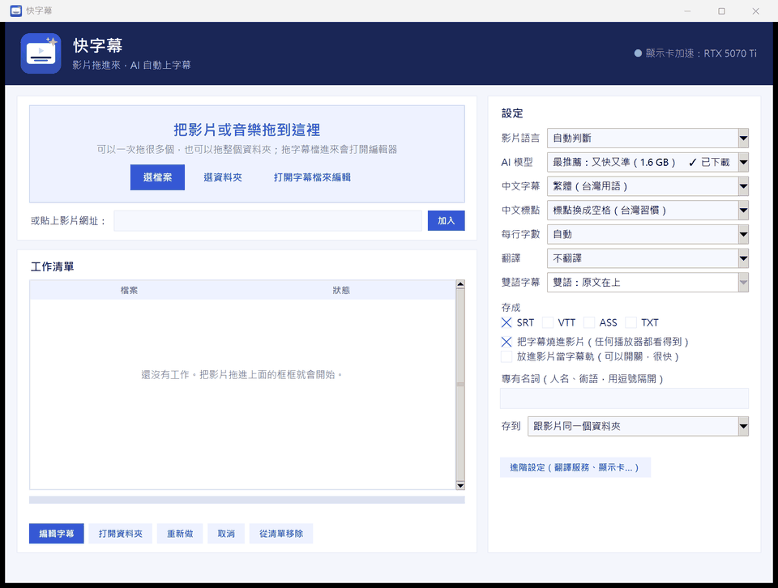
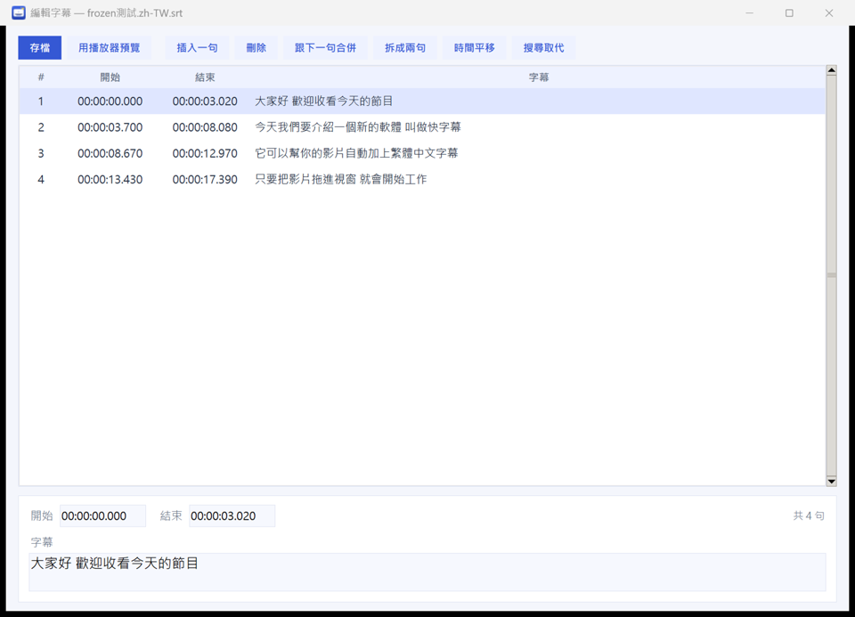

<p align="center"></p>

<h1 align="center">快字幕 QuickSub</h1>

<p align="center">
<b>影片拖進來，AI 自動上字幕。</b>繁體中文、台灣用語、會翻譯、能燒進影片。<br>
在你自己的電腦上跑，不用上傳、不用註冊、免費。有 NVIDIA 顯示卡的話，一小時的影片幾分鐘就好。
</p>

<p align="center">
<a href="https://github.com/Benjaminwz/quicksub/releases/latest"><b>⬇ 下載 Windows 版</b></a> ·
<a href="#english">English</a>
</p>

<p align="center"></p>

## 功能

- **即時字幕（線上影片、直播）：** 直接聽電腦正在播放的聲音，AI 邊聽邊寫，字幕顯示在螢幕最上層（白字黑邊、沒有底色，可以拖到任何位置）。YouTube、Netflix、Twitch、線上課程、視訊會議都能用，也能即時翻譯成雙語，看完可以存成 SRT
- **拖進來就好：** 影片、音樂都可以，一次很多個、整個資料夾也行；也能貼 YouTube 等影片網址直接下載再上字幕
- **聽得準：** 用 OpenAI Whisper（faster-whisper 版本），自動判斷是哪種語言，支援中、英、日、韓、粵語等 20 多種
- **台灣人看得習慣：** 中文自動轉成**繁體、台灣用語**（OpenCC）；標點可以照台灣字幕習慣換成空格
- **斷句漂亮：** 依每個字的時間點重新斷句，優先在句號、逗號、停頓的地方換行，每行字數可以設定
- **不亂加字：** 自動濾掉 AI 在沒聲音的地方常「聽」出來的句子（像「請不吝點讚訂閱」），也會先跳過沒有人聲的片段
- **專有名詞：** 填上人名、術語，AI 聽寫時會優先用這些字
- **翻譯、雙語字幕：** 翻成繁體中文、英文、日文、韓文等，可以做雙語字幕（原文在上或翻譯在上）
  - 本機的 **Ollama**：免費、不上網
  - 或填**線上 AI** 的金鑰：Google Gemini、DeepSeek、OpenAI，或其他相容 OpenAI 格式的服務
- **字幕編輯器：** 逐句改文字和時間、插入／刪除／合併／拆開、整體時間平移、搜尋取代，用播放器預覽；改完可以一鍵用新字幕重做影片
- **輸出：** SRT、VTT、ASS、TXT；**燒進影片**（任何播放器、社群網站都看得到，有 NVIDIA 顯示卡會用顯示卡編碼）；或**放進影片當字幕軌**（可以開關，幾秒就好）
- **用起來方便：** 檔案右鍵「傳送到 → 快字幕」；字幕檔名是「影片名稱.zh-TW.srt」，大部分播放器會自動載入
- **中英文介面**，GitHub 有新版時按一下就更新

| 字幕編輯器 | 燒進影片的樣子 |
| --- | --- |
|  |  |

## 下載和安裝

1. 到 [Releases](https://github.com/Benjaminwz/quicksub/releases/latest) 下載 `QuickSub-Setup-x.x.x.exe`，照著裝（不用系統管理員權限）。
   不想安裝的話，下載 `QuickSub-x.x.x-portable.zip`，解壓縮後打開 `QuickSub.exe`。
2. 打開快字幕，把影片拖進去。

第一次用的時候會自動下載需要的東西，只有第一次：

| 下載什麼 | 大小 | 什麼時候 |
| --- | --- | --- |
| AI 模型（最推薦的 large-v3-turbo） | 1.6 GB | 第一次上字幕 |
| 顯示卡加速元件（NVIDIA cuBLAS、cuDNN） | 1.3 GB | 有 NVIDIA 顯示卡時 |
| ffmpeg | 約 150 MB | 第一次燒字幕、放字幕軌、下載網址 |
| yt-dlp、Deno | 約 60 MB | 第一次貼網址 |

都放在 `%LOCALAPPDATA%\QuickSub`，解除安裝時會問你要不要一起刪掉。

**電腦需求：** Windows 10／11（64 位元）。有 NVIDIA 顯示卡（GTX 16 系列以後、驅動程式夠新）最快；沒有也能用，只是比較慢，建議在「AI 模型」選小一點的（small）。

## 怎麼用

1. **拖影片進去**（或按「選檔案」、貼網址），就會開始排隊處理，右邊的設定隨時可以改（改了之後加入的影片才會套用）。
2. 做好的字幕會存在影片旁邊，檔名像 `我的影片.zh-TW.srt`。燒好字幕、加了字幕軌的影片放在旁邊的「字幕影片」資料夾（`我的影片.燒字幕.mp4`、`我的影片.字幕軌.mp4`）。分開放是為了不讓播放器把字幕檔再疊一層上去。
   - 用 VLC 看：VLC 預設會在影片開頭 5 秒於下方顯示檔名，看起來像一行字幕；不想要的話到「工具 → 偏好設定 → 字幕／OSD」取消「在影片開始時顯示媒體標題」。
3. 想修改：在清單上點兩下那個工作，打開**字幕編輯器**。改完按「存檔」；有燒進影片的話，按「用新字幕重做影片」。
4. **看線上影片、直播：** 按「● 即時字幕」→「開始」，字幕會出現在螢幕下方。用滑鼠拖字幕可以移動，滾輪或右鍵可以調字的大小。
   有開翻譯的話，大字是最近翻好的那句（比聲音晚一兩秒），下面淡淡的小字是正在講的原文。「聽哪裡」可以改成別的喇叭或麥克風。
5. 已經有字幕檔想改：把 `.srt`／`.vtt` 拖進去，或按「打開字幕檔來編輯」。

### 翻譯要先設定一下

在「翻譯」選要翻成哪種語言，然後到「進階設定」選翻譯服務：

- **本機的 Ollama（免費）：** 先安裝 [Ollama](https://ollama.com/download)，下載一個模型，例如在命令列打 `ollama pull qwen2.5:7b`。快字幕會自動找到它。
- **線上 AI（翻得比較好）：** 選服務、貼上金鑰（按「怎麼拿金鑰？」會打開申請頁面）。Google Gemini 有免費額度。金鑰只存在你的電腦裡。

按「測試翻譯」可以先確定能不能用。

## 常見問題

- **準不準？** 用最推薦的模型，清楚的說話聲大多很準。背景音樂很大、很多人同時說話、口音很重時會差一點。人名、術語填在「專有名詞」會好很多，剩下的用編輯器修就好。
- **會把我的影片傳到網路上嗎？** 不會。聽寫完全在你的電腦上做。只有你選了「線上 AI」翻譯時，字幕文字（不是影片）會送到那個服務。
- **顯示卡加速失敗？** 快字幕會自動改用處理器繼續，不會卡住。詳細原因在 `%LOCALAPPDATA%\QuickSub\worker.log`。先確認 NVIDIA 驅動程式是新的。
- **即時字幕會慢多少？** 講完一句大約 1 秒出現；開翻譯再晚一點。用本機的 deepseek-r1 翻譯時，快字幕會叫它跳過「思考」直接回答，一次只要零點幾秒。
- **即時字幕被遊戲蓋住？** 遊戲用「獨佔全螢幕」時什麼都蓋不過去，改成「無邊框視窗」就行；瀏覽器的全螢幕沒問題。
- **可以分辨是誰在說話嗎？** 目前還不行。

## 自己從原始碼跑

```bash
python -m venv .venv
.venv\Scripts\pip install -r requirements.txt
.venv\Scripts\python quicksub.pyw
```

用原始碼跑、又想用顯示卡的話，再裝 `nvidia-cublas-cu12`、`nvidia-cudnn-cu12`（或讓程式自己下載）。

打包（要 [Inno Setup 6](https://jrsoftware.org/isdl.php)，venv 裡再裝 `pyinstaller`）：

```bash
powershell -ExecutionPolicy Bypass -File build_release.ps1 -Version 1.0.0
```

程式架構：

- `quicksub.pyw`：主視窗。
- `qs/engine.py`：AI 聽寫。在另一個背景程式裡跑，顯示卡元件出問題也不會讓主視窗當掉，會自動改用處理器；按取消會直接結束背景程式。
- `qs/subs.py`：斷句（動態規劃找最自然的換行位置）、繁簡轉換、各種字幕格式。
- `qs/translate.py`：翻譯。一次送一批有編號的句子，對不上就拆小重送。
- `qs/media.py`：ffmpeg、yt-dlp。
- `qs/pipeline.py`：一個工作從頭到尾的流程。
- `qs/editor.py`：字幕編輯器。

## 用到的開源專案

[OpenAI Whisper](https://github.com/openai/whisper) 模型、[faster-whisper](https://github.com/SYSTRAN/faster-whisper)、[CTranslate2](https://github.com/OpenNMT/CTranslate2)、
[OpenCC](https://github.com/BYVoid/OpenCC)（[Python 版](https://github.com/yichen0831/opencc-python)）、[FFmpeg](https://ffmpeg.org/)、[yt-dlp](https://github.com/yt-dlp/yt-dlp)、[Deno](https://deno.com/)、[tkinterdnd2](https://github.com/Eliav2/tkinterdnd2)。
ffmpeg、yt-dlp、Deno 和 AI 模型不包在安裝檔裡，第一次需要時才從它們的官方來源下載。

同一位作者的其他作品：[口袋快傳 PocketDrop](https://github.com/Benjaminwz/pocketdrop)（手機電腦互傳）、[耳機調音台](https://github.com/Benjaminwz/headphone-tuner)、[藍色大肥魚](https://github.com/Benjaminwz/bluefish-discord-bot)（Discord 機器人）。

授權：[MIT](LICENSE)

---

<a id="english"></a>

## English

**QuickSub** makes subtitles for your videos with AI. Drop in a video and get an SRT. It runs entirely on your PC: no upload, no account, free. With an NVIDIA GPU, an hour of video takes a few minutes.

- **Live subtitles** for anything playing on your PC (YouTube, Netflix, streams, classes, meetings): an always-on-top caption bar, optional live translation, save as SRT afterwards.
- **Drag and drop** videos, audio, whole folders, or paste a YouTube (or other) link.
- **Accurate transcription** with Whisper (faster-whisper) and automatic language detection. Supports 20+ languages.
- **Chinese done right:** converts to Traditional Chinese with Taiwanese wording (OpenCC), and can use Taiwan-style punctuation.
- **Natural line breaks** from word timings. Filters common Whisper hallucinations and skips silence.
- **Glossary:** list names and terms so the AI spells them right.
- **Translate and make bilingual subtitles** with local Ollama (free, offline) or an online AI (Gemini, DeepSeek, OpenAI, any OpenAI-compatible API).
- **Subtitle editor:** edit text and timing, insert, delete, merge, split, shift, find and replace, preview in your player.
- **Output:** SRT, VTT, ASS, TXT. It can also **burn subtitles into the video** (GPU-encoded with NVENC) or **add a soft subtitle track**.
- Right-click **Send to → QuickSub**, English and Chinese UI, one-click updates.

**Install:** download `QuickSub-Setup-x.x.x.exe` (or the portable zip) from [Releases](https://github.com/Benjaminwz/quicksub/releases/latest). The AI model (1.6 GB), NVIDIA GPU libraries (1.3 GB), ffmpeg and yt-dlp download automatically the first time they're needed. They're stored in `%LOCALAPPDATA%\QuickSub`.

**Translation:** pick a target language, then choose a service in *More settings*: Ollama (install it and `ollama pull qwen2.5:7b`) or an online AI with your API key. The key stays on your PC.

**Privacy:** transcription never leaves your computer. Only when you choose an online AI for translation is the subtitle text (not the video) sent to that service.

**Run from source:** `pip install -r requirements.txt`, then `python quicksub.pyw`. To build: `build_release.ps1 -Version x.y.z` (needs PyInstaller and Inno Setup 6).

License: [MIT](LICENSE)
